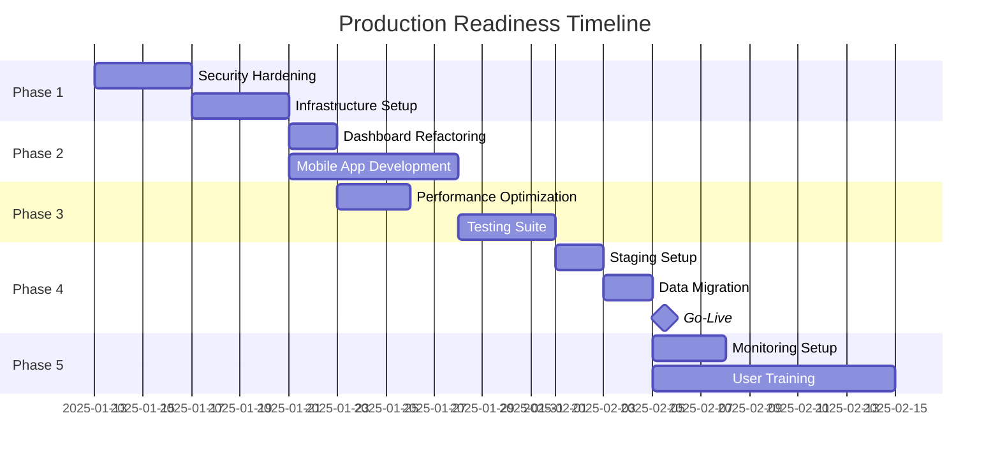

# AJ-HCP-LE Production Readiness Plan

## Executive Summary

The AJ-HCP-LE electrical contracting field service management system is currently at **80-85% production readiness**. This comprehensive plan outlines the critical path to full production deployment, prioritizing tasks by business impact and technical risk.

**Current Status:**
- Strong technical foundation with React 19/TypeScript frontend and Django 4.2 backend
- Core functionality operational (customer management, job tracking, billing)
- Security infrastructure in place but needs enhancement
- Testing coverage at 80%+ but missing critical E2E tests
- Mobile app in early development stage
- Deployment ready for Railway/Vercel but needs production hardening

**Critical Path to Production:** 4-6 weeks with focused effort

---

## Phase 1: Critical Security & Infrastructure (Week 1-2)
**Priority: CRITICAL | Business Impact: HIGH | Technical Risk: HIGH**

### 1.1 Security Hardening
**Timeline: 3-4 days | Resources: 1 Backend Developer**

#### Immediate Actions:
1. **Implement Two-Factor Authentication (2FA)**
   ```python
   # Install django-two-factor-auth
   pip install django-two-factor-auth
   # Configure in settings.py
   # Add TOTP/SMS authentication options
   ```
   - Estimated effort: 8 hours
   - Dependencies: Twilio API for SMS
   - Testing required: Unit + Integration tests

2. **Security Audit & Penetration Testing**
   - Run OWASP ZAP automated security scan
   - Implement security headers middleware
   - Fix any identified vulnerabilities
   - Document security measures
   - Estimated effort: 16 hours

3. **Database Encryption at Rest**
   ```sql
   -- Enable PostgreSQL encryption
   ALTER DATABASE fsm_production SET encryption = 'AES256';
   ```
   - Configure encrypted backups
   - Test restore procedures
   - Estimated effort: 4 hours

#### Blockers & Mitigation:
- **Blocker**: Third-party authentication service integration
- **Mitigation**: Start with TOTP, add SMS later

### 1.2 Production Infrastructure Setup
**Timeline: 3-4 days | Resources: 1 DevOps Engineer**

#### Immediate Actions:
1. **Configure Production Environment**
   ```yaml
   # docker-compose.prod.yml enhancements
   services:
     web:
       restart: always
       healthcheck:
         test: ["CMD", "curl", "-f", "http://localhost:8000/health"]
         interval: 30s
         timeout: 10s
         retries: 3
   ```

2. **Setup Monitoring & Alerting**
   - Deploy Sentry for error tracking
   - Configure Prometheus + Grafana
   - Setup PagerDuty integration
   - Create runbooks for common issues
   - Estimated effort: 12 hours

3. **Load Balancing & Auto-scaling**
   - Configure NGINX load balancer
   - Setup horizontal pod autoscaling
   - Test failover scenarios
   - Estimated effort: 8 hours

---

## Phase 2: Critical Business Features (Week 2-3)
**Priority: HIGH | Business Impact: HIGH | Technical Risk: MEDIUM**

### 2.1 Dashboard Refactoring
**Timeline: 2 days | Resources: 1 Frontend Developer**

#### Current Issues:
- Component is too large (350+ lines)
- Mixed concerns (data fetching, UI, business logic)
- Hard-coded change percentages
- No error boundaries

#### Refactoring Plan:
```typescript
// Extract into smaller components
- DashboardStats.tsx (stats cards logic)
- QuickActions.tsx (action cards)
- useDashboardData.ts (custom hook for data)
- DashboardMetrics.tsx (metrics display)

// Implement proper error handling
const [error, setError] = useState<Error | null>(null);
const [retryCount, setRetryCount] = useState(0);

// Add real-time updates
useEffect(() => {
  const interval = setInterval(loadDashboardData, 60000);
  return () => clearInterval(interval);
}, []);
```

### 2.2 Complete Mobile App Core Features
**Timeline: 5-7 days | Resources: 1 Mobile Developer**

#### Priority Features:
1. **Offline Capability**
   ```typescript
   // Implement Redux Persist + AsyncStorage
   import AsyncStorage from '@react-native-async-storage/async-storage';
   const persistConfig = {
     key: 'root',
     storage: AsyncStorage,
     whitelist: ['jobs', 'auth']
   };
   ```

2. **Push Notifications**
   - Integrate Firebase Cloud Messaging
   - Job assignment notifications
   - Schedule reminders
   - Status update alerts

3. **Photo Upload & Signatures**
   - Camera integration for job photos
   - Digital signature capture
   - Offline queue for uploads

---

## Phase 3: Performance & Testing (Week 3-4)
**Priority: HIGH | Business Impact: MEDIUM | Technical Risk: LOW**

### 3.1 Performance Optimization
**Timeline: 3 days | Resources: 1 Full-stack Developer**

#### Optimization Tasks:
1. **Frontend Bundle Optimization**
   ```javascript
   // webpack.optimization.config.js updates
   optimization: {
     splitChunks: {
       chunks: 'all',
       cacheGroups: {
         vendor: {
           test: /[\\/]node_modules[\\/]/,
           name: 'vendors',
           priority: 10
         }
       }
     }
   }
   ```
   - Target: Reduce bundle size by 40%
   - Implement route-based code splitting
   - Add webpack-bundle-analyzer

2. **Database Query Optimization**
   ```python
   # Add select_related and prefetch_related
   jobs = Job.objects.select_related('customer', 'technician')
                     .prefetch_related('line_items')
                     .filter(status='active')
   ```
   - Add database indexes for common queries
   - Implement query result caching
   - Monitor slow queries

3. **API Response Optimization**
   - Implement pagination for all list endpoints
   - Add field filtering capabilities
   - Enable gzip compression
   - Cache frequently accessed data

### 3.2 Comprehensive Testing Suite
**Timeline: 4 days | Resources: 1 QA Engineer + 1 Developer**

#### Testing Implementation:
1. **End-to-End Testing**
   ```typescript
   // Complete E2E test scenarios
   - User registration → login → create job → complete job → invoice
   - Customer creation → job assignment → scheduling → completion
   - Inventory management → part usage → reorder alerts
   ```

2. **Load Testing**
   ```javascript
   // k6 load test script
   export let options = {
     stages: [
       { duration: '5m', target: 100 },
       { duration: '10m', target: 100 },
       { duration: '5m', target: 0 },
     ],
     thresholds: {
       http_req_duration: ['p(95)<500'],
     },
   };
   ```

3. **Security Testing**
   - SQL injection tests
   - XSS vulnerability scans
   - Authentication bypass attempts
   - API rate limiting verification

---

## Phase 4: Deployment & Go-Live (Week 4-5)
**Priority: CRITICAL | Business Impact: CRITICAL | Technical Risk: MEDIUM**

### 4.1 Staging Environment Setup
**Timeline: 2 days | Resources: 1 DevOps Engineer**

#### Configuration:
```yaml
# staging.env configuration
ENVIRONMENT=staging
DATABASE_URL=postgresql://staging_user@staging-db:5432/fsm_staging
REDIS_URL=redis://staging-redis:6379/0
DEBUG=False
ALLOWED_HOSTS=staging.aj-long-electric.com
```

- Mirror production configuration
- Implement blue-green deployment
- Setup automated deployment pipeline
- Configure rollback procedures

### 4.2 Data Migration Strategy
**Timeline: 2 days | Resources: 1 Database Admin + 1 Developer**

#### Migration Plan:
1. **Data Validation**
   ```python
   # validation script
   def validate_customer_data():
       invalid_records = []
       for customer in Customer.objects.all():
           if not customer.email or not customer.phone:
               invalid_records.append(customer.id)
       return invalid_records
   ```

2. **Migration Steps**
   - Backup existing data
   - Run validation scripts
   - Execute migration in batches
   - Verify data integrity
   - Update foreign key relationships

### 4.3 Go-Live Checklist
**Timeline: 1 day | Resources: Full team**

#### Pre-Launch (T-24 hours):
- [ ] Final security scan completed
- [ ] All critical bugs resolved
- [ ] Load testing passed (100 concurrent users)
- [ ] Backup procedures tested
- [ ] Rollback plan documented
- [ ] SSL certificates installed
- [ ] DNS configured
- [ ] Monitoring alerts configured

#### Launch Day (T-0):
- [ ] Database migration completed
- [ ] Application deployed to production
- [ ] Smoke tests passed
- [ ] User acceptance testing completed
- [ ] Support team briefed
- [ ] Communication sent to users

#### Post-Launch (T+24 hours):
- [ ] Monitor error rates
- [ ] Review performance metrics
- [ ] Address critical issues
- [ ] Gather user feedback
- [ ] Document lessons learned

---

## Phase 5: Post-Launch Optimization (Week 5-6)
**Priority: MEDIUM | Business Impact: MEDIUM | Technical Risk: LOW**

### 5.1 Monitoring & Maintenance
**Timeline: Ongoing | Resources: 1 DevOps Engineer (part-time)**

#### Implementation:
1. **Application Performance Monitoring**
   ```python
   # Django APM integration
   INSTALLED_APPS += ['elasticapm.contrib.django']
   ELASTIC_APM = {
       'SERVICE_NAME': 'fsm-production',
       'SERVER_URL': 'http://apm-server:8200',
   }
   ```

2. **Business Metrics Dashboard**
   - Daily active users
   - Job completion rates
   - Revenue tracking
   - System performance metrics

3. **Automated Reporting**
   - Weekly performance reports
   - Monthly business metrics
   - Quarterly security audits

### 5.2 User Training & Support
**Timeline: 2 weeks | Resources: 1 Technical Writer + Support Team**

#### Deliverables:
1. **Documentation**
   - User manual (30 pages)
   - Admin guide (20 pages)
   - API documentation
   - Video tutorials (10 videos)

2. **Training Program**
   - Admin training (4 hours)
   - User training (2 hours)
   - Technician app training (1 hour)

3. **Support Infrastructure**
   - Help desk setup
   - FAQ database
   - Ticketing system
   - Knowledge base

---

## Resource Requirements

### Team Composition:
- **Backend Developer**: 80 hours
- **Frontend Developer**: 60 hours
- **Mobile Developer**: 40 hours
- **DevOps Engineer**: 60 hours
- **QA Engineer**: 40 hours
- **Technical Writer**: 20 hours
- **Project Manager**: 40 hours

**Total Effort**: 340 hours (approximately 8.5 person-weeks)

### Infrastructure Costs (Monthly):
- **Production Servers**: $200-300 (Railway/Vercel)
- **Database (PostgreSQL)**: $50-100
- **Redis Cache**: $30-50
- **CDN (Cloudflare)**: $20-50
- **Monitoring (Sentry/Datadog)**: $50-100
- **Backup Storage**: $20-30

**Total Monthly Cost**: $370-630

---

## Risk Matrix & Mitigation

### High-Risk Items:
1. **Mobile App Completion**
   - Risk: May not be ready for launch
   - Mitigation: Launch web-first, mobile as Phase 2
   - Impact: Medium (technicians can use mobile web)

2. **Data Migration**
   - Risk: Data loss or corruption
   - Mitigation: Multiple backups, staged migration
   - Impact: Critical (could affect all operations)

3. **Performance Under Load**
   - Risk: System crashes with real usage
   - Mitigation: Thorough load testing, auto-scaling
   - Impact: High (user experience, reputation)

### Medium-Risk Items:
1. **Third-party Integration Failures**
   - Risk: Payment, SMS services unavailable
   - Mitigation: Fallback providers, queuing system
   - Impact: Medium (temporary service degradation)

2. **Security Vulnerabilities**
   - Risk: Data breach, unauthorized access
   - Mitigation: Regular audits, immediate patching
   - Impact: High (legal, reputation)

---

## Success Metrics

### Technical Metrics:
- **Uptime**: 99.9% availability
- **Response Time**: <500ms p95
- **Error Rate**: <0.1%
- **Test Coverage**: >90%
- **Security Score**: A+ SSL Labs

### Business Metrics:
- **User Adoption**: 80% within 30 days
- **Job Completion Rate**: >95%
- **Invoice Processing Time**: <2 minutes
- **Customer Satisfaction**: >4.5/5
- **Support Ticket Resolution**: <24 hours

---

## Timeline Summary



---

## Next Steps

### Immediate Actions (Next 48 hours):
1. **Team Assembly**: Confirm resource availability
2. **Environment Setup**: Create staging environment
3. **Security Audit**: Run initial security scan
4. **Dependency Check**: Update all packages to latest stable versions
5. **Communication Plan**: Notify stakeholders of timeline

### Week 1 Deliverables:
- [ ] 2FA implementation complete
- [ ] Security vulnerabilities patched
- [ ] Production environment configured
- [ ] Monitoring infrastructure deployed
- [ ] Load testing environment ready

### Critical Dependencies:
1. **SSL Certificates**: Order and validate
2. **Domain Configuration**: Update DNS records
3. **Third-party Services**: Verify API keys and limits
4. **Legal Compliance**: Review data protection requirements
5. **Backup Strategy**: Test restore procedures

---

## Conclusion

The AJ-HCP-LE system has a solid foundation and can reach production readiness within 4-6 weeks with focused effort. The critical path involves:

1. **Security hardening** to protect customer data
2. **Infrastructure setup** for reliability and scalability
3. **Mobile app completion** for field technician efficiency
4. **Comprehensive testing** to ensure quality
5. **Smooth deployment** with proper monitoring

By following this plan, the system will transition from 80% to 100% production readiness, providing a robust, secure, and scalable solution for AJ Long Electric's field service management needs.

**Recommended Go-Live Date**: February 21, 2025 (6 weeks from plan initiation)

---

*This document should be reviewed weekly and updated as tasks are completed or requirements change.*